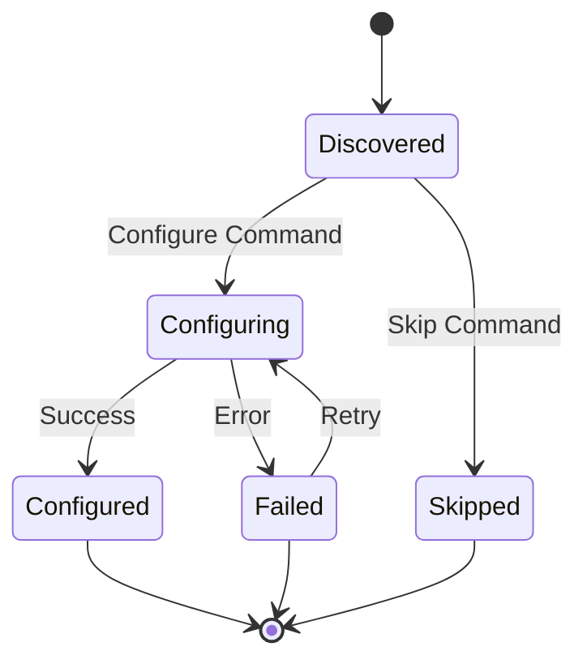

# Architecture Overview

## System Architecture

The Axis Camera Configuration Tool follows a layered architecture pattern with clear separation of concerns:

```
┌─────────────────────────────────────────┐
│               Presentation              │
│            (WPF Application)            │
│  ┌─────────────┐  ┌─────────────────┐   │
│  │ MainWindow  │  │   ViewModels    │   │
│  │   (XAML)    │  │ (MVVM Pattern)  │   │
│  └─────────────┘  └─────────────────┘   │
└─────────────────────────────────────────┘
                     │
                     ▼
┌─────────────────────────────────────────┐
│              Application                │
│              (Core Logic)               │
│  ┌─────────────┐  ┌─────────────────┐   │
│  │  Services   │  │   Interfaces    │   │
│  │             │  │                 │   │
│  └─────────────┘  └─────────────────┘   │
└─────────────────────────────────────────┘
                     │
                     ▼
┌─────────────────────────────────────────┐
│              Domain                     │
│           (Business Models)             │
│  ┌─────────────┐  ┌─────────────────┐   │
│  │CameraRecord │  │  CameraState    │   │
│  │             │  │                 │   │
│  └─────────────┘  └─────────────────┘   │
└─────────────────────────────────────────┘
                     │
                     ▼
┌─────────────────────────────────────────┐
│            Infrastructure               │
│         (External Systems)              │
│  ┌─────────────┐  ┌─────────────────┐   │
│  │   Network   │  │    File I/O     │   │
│  │  Discovery  │  │    Logging      │   │
│  └─────────────┘  └─────────────────┘   │
└─────────────────────────────────────────┘
```

## Core Components

### Domain Layer

**CameraRecord**: Central entity representing a camera with its configuration state
- MAC Address (unique identifier)
- IP addresses (current and target)
- Configuration state and metadata
- Error tracking and attempt counting

**CameraState**: Enumeration of possible camera states
- Discovered → Configuring → Configured
- Failed state for error handling
- Skipped state for manual override

### Application Layer

**Service Interfaces**:
- `IDiscoveryService`: Network camera discovery
- `IAxisApiClient`: Communication with Axis cameras
- `IIpAllocationService`: IP address management

**Service Implementations** (Current: Stub versions):
- `DiscoveryServiceStub`: Mock camera discovery
- `AxisApiClientStub`: Mock camera configuration
- `IpAllocationService`: IP range management

### Presentation Layer

**MVVM Pattern**:
- `MainViewModel`: Primary application logic
- `CameraViewModel`: Individual camera representation
- `RelayCommand`: Command pattern implementation

**UI Components**:
- MainWindow: Primary application interface
- Configuration controls (mode selection)
- Real-time camera list with data binding

## Planned State Machine



## Data Flow

### Discovery Process
1. Timer triggers discovery service
2. Service scans network for cameras
3. Discovered cameras converted to ViewModels
4. UI updated via data binding
5. Auto-assignment of IPs in automatic mode

### Configuration Process
1. User selects camera and triggers configuration
2. ViewModel updates camera state to "Configuring"
3. Service called with camera and target IP
4. Result updates camera state and UI
5. Logging captures all operations

## Technology Stack

### Core Technologies
- **.NET 8**: Runtime and base libraries
- **WPF**: User interface framework
- **C# 12**: Programming language with latest features

### Dependencies
- **Serilog**: Structured logging
- **Microsoft.Extensions.Hosting**: Dependency injection and configuration
- **xUnit**: Unit testing framework
- **FluentAssertions**: Test assertions

### Future Integrations
- **WiX Toolset**: MSI installer creation
- **System.Net**: Network operations for discovery
- **HttpClient**: VAPIX API communication

## Configuration Management

**appsettings.json Structure**:
```json
{
  "Provisioning": {
    "ScanIntervalSeconds": 10,
    "MaxConcurrentConfig": 3,
    "RetryPolicy": { ... },
    "IpRange": { ... }
  }
}
```

**Dependency Injection**: All services registered in `App.xaml.cs` using `Microsoft.Extensions.DependencyInjection`

## Security Considerations

### Current Implementation
- No sensitive data handling yet
- Local file logging only
- No network credentials stored

### Planned Security Features
- Credential encryption for camera access
- Log redaction for sensitive information
- Secure communication with cameras (HTTPS)
- Input validation for all network operations

## Extensibility Points

### Service Interfaces
Easy to swap implementations:
- Discovery: From stub → real network scanning
- API Client: From stub → VAPIX integration
- IP Allocation: Add conflict detection

### Configuration
- Multiple IP ranges
- Custom discovery methods
- Flexible retry policies

### UI Extensibility
- Plugin architecture for custom actions
- Themeable interface
- Multi-language support

## Performance Considerations

### Current Optimizations
- Async operations for all I/O
- UI updates on dispatcher thread
- Efficient ObservableCollection updates

### Planned Optimizations
- Parallel camera configuration
- Connection pooling for API calls
- Caching of camera information
- Background processing queue

## Error Handling Strategy

### Logging
- Structured logging with correlation IDs
- File rotation (7-day retention)
- Different log levels by component

### User Experience
- Clear error messages in UI
- Retry mechanisms for transient failures
- Graceful degradation of features

### Recovery
- Automatic retry with backoff
- Manual retry options
- State persistence for resilience

## Testing Strategy

### Unit Tests
- Service logic isolated and tested
- Mock dependencies for predictable tests
- High coverage of business logic

### Integration Tests (Planned)
- End-to-end camera configuration
- Network discovery validation
- Error scenario testing

### UI Testing (Planned)
- Automated UI testing with WinAppDriver
- Manual test scenarios documented
- Performance testing under load

This architecture provides a solid foundation for the current MVP while supporting the planned evolution into a full-featured camera configuration tool.